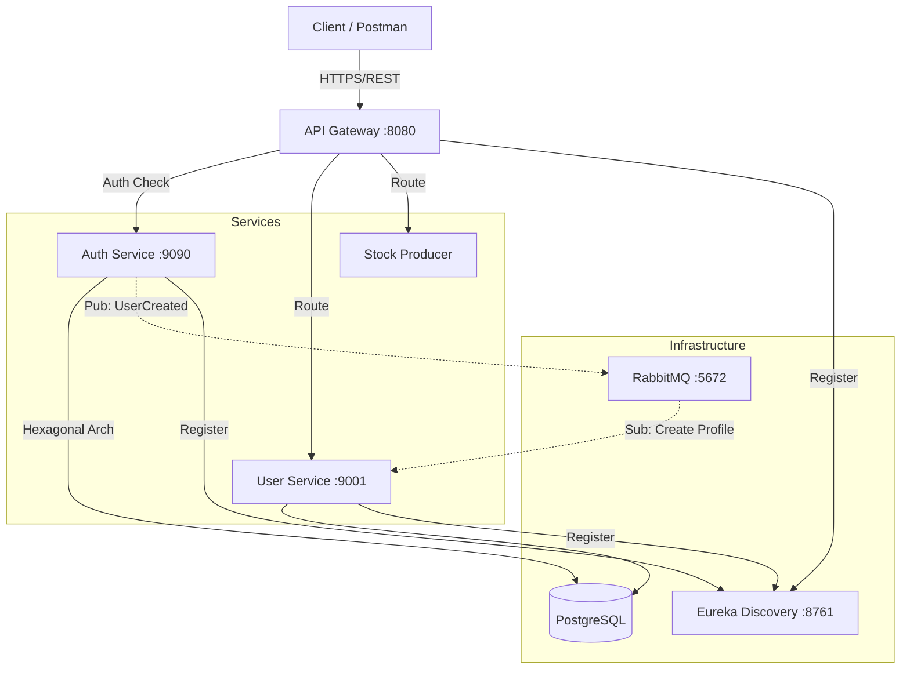

# InDepthStudy - E-commerce Microservices


---

## 📖 Sobre o Projeto

**InDepthStudy** é um laboratório prático de desenvolvimento de software focado em arquitetura de microsserviços. Este projeto serve como base de estudos aprofundados para a implementação futura da plataforma de e-commerce **Vovó Crochê**.

O objetivo principal é dominar ferramentas de mercado, padrões de arquitetura (como Hexagonal e Event-Driven), segurança com OAuth2 e infraestrutura em nuvem, simulando cenários reais de alta disponibilidade e escalabilidade.

---

## 🏗️ Arquitetura Atual

O sistema adota uma arquitetura de microsserviços distribuída, utilizando comunicação síncrona (REST) e assíncrona (Mensageria).



---

## 🧩 Catálogo de Serviços

| Serviço         | Porta | Descrição                                                 | Stack / Pattern                                    |
| --------------- | ----- | --------------------------------------------------------- | -------------------------------------------------- |
| Eureka Service  | 8761  | Service Discovery & Registry                              | Spring Netflix Eureka                              |
| API Gateway     | 8080  | Ponto de entrada único, roteamento e cliente OAuth2       | Spring Cloud Gateway                               |
| Auth Service    | 9090  | Servidor de Identidade (IdP). Emite JWT e gerencia acesso | Hexagonal, Spring Authorization Server, PostgreSQL |
| User Service    | 9001  | Gerencia dados de perfil e negócio do usuário             | Spring Data JPA, RabbitMQ Consumer                 |
| Stock/Price App | —     | Serviços legados para estudo de mensageria                | Producer / Consumer Pattern                        |
| RabbitMQ        | 5672  | Broker de mensagens para eventos de domínio               | AMQP                                               |

---

## 🔐 Fluxo de Segurança e Sincronização

### 🔑 Autenticação (OAuth2 & JWT)

* O **auth-service** atua como um Authorization Server (semelhante ao Keycloak)
* Emite tokens JWT assinados
* O **api-gateway** valida os tokens e aplica regras de autorização por escopo (ex: `ADMIN`, `CLIENT`)

### 🔄 Sincronia de Dados (Event-Driven)

* Ao criar um usuário no **auth-service**, um evento `UserCreated` é publicado no RabbitMQ
* O **user-service** consome este evento e cria automaticamente o perfil de negócio
* Garante desacoplamento e consistência eventual entre autenticação e domínio de negócio

---

## 📂 Estrutura do Projeto

```plaintext
In-depthStudy /
├── eurekaservice      # Service Discovery
├── gateway            # API Gateway & Load Balancer
├── authservice        # OAuth2 Server & User Credentials (Hexagonal)
├── userservice        # User Profile Management
├── stockpriceapp      # Stock Producer example
├── priceconsumer      # Consumer example
├── stockconsumer      # Consumer example
└── infra              
    ├── docker_app     # Docker Compose das Aplicações
    └── docker_db      # Docker Compose dos Bancos de Dados
```

---

## 🛠️ Como Executar o Projeto

### 📋 Pré-requisitos

Certifique-se de ter instalado em sua máquina:

* IntelliJ IDE ou IDE da sua preferência
```bash
https://download.jetbrains.com/idea/ideaIC-2025.2.6.1.exe?_gl=1*fup02*_ga*NTE1Mzk2NTQwLjE3NjU1MDMwNDg.*_ga_9J976DJZ68*czE3Njk1NDA2OTUkbzMkZzAkdDE3Njk1NDA2OTYkajYwJGwwJGgw*_gcl_au*MTQwMjQwODg2MS4xNzY1NTAzMDQ4*FPAU*MTQwMjQwODg2MS4xNzY1NTAzMDQ4
```
* Java 17+ (JDK)
```bash
https://www.oracle.com/br/java/technologies/javase/javase8-archive-downloads.html#:~:text=jdk%2D8u202%2Dwindows%2Dx64.exe
```
* Maven 3.8+
* Docker Desktop
```bash
https://desktop.docker.com/win/main/amd64/Docker%20Desktop%20Installer.exe?utm_source=docker&utm_medium=webreferral&utm_campaign=docs-driven-download-win-amd64
```
* Git
```bash
https://github.com/git-for-windows/git/releases/download/v2.52.0.windows.1/Git-2.52.0-64-bit.exe
```

---

### 🚀 Passo a Passo

#### 1️⃣ Clonar o Repositório

```bash
git clone https://github.com/luger-mano/In-depthStudy.git
cd In-depthStudy
```

---

#### 2️⃣ Subir a Infraestrutura de Banco de Dados

```bash
cd infra/docker_db
docker-compose up -d
cd ../..
```

---

#### 3️⃣ Gerar os Artefatos (Build do Maven)

```bash
mvn clean package -DskipTests
```

---

#### 4️⃣ Construir as Imagens Docker

```bash
# Eureka Service
docker build -t eurekaservice-img ./eurekaservice

# API Gateway
docker build -t gateway-img ./gateway

# Stock Producer
docker build -t stockpriceapp-img ./stockpriceapp

# Stock Consumer
docker build -t stockconsumer-img ./stockconsumer
```

> ⚠️ Certifique-se de que os nomes das imagens correspondem aos definidos no `docker-compose.yml`.

---

#### 5️⃣ Executar a Aplicação (Docker Compose)

```bash
cd infra/docker_app
docker-compose up -d
```

---

#### 6️⃣ Executar Serviços Localmente (Opcional)

```bash
# Auth Service
cd authservice
mvn spring-boot:run

# User Service
cd userservice
mvn spring-boot:run
```

---

## ✅ Verificando se tudo está rodando

* **Eureka Dashboard:** [http://localhost:8761](http://localhost:8761)
* **API Gateway:** [http://localhost:8080](http://localhost:8080)

---

## 🛣️ Roadmap & Próximos Passos

### 🌟 Novos Microsserviços

* [ ] Notification Service (MongoDB / Redis)
* [ ] Product Service (MongoDB / Redis)
* [ ] Shop Cart Service (MongoDB / Redis)
* [ ] Payment Service (Efí Bank API)

### ⚙️ Engenharia & DevOps

* [ ] Idempotência de mensagens (RabbitMQ)
* [ ] Cache distribuído com Redis
* [ ] Otimização de performance em mensageria

### ☁️ Cloud (AWS)

* [ ] Deploy em EC2
* [ ] Armazenamento de imagens no S3
* [ ] Migração de banco para RDS

---

## 👨‍💻 Autor

Desenvolvido com foco em excelência técnica, arquitetura escalável e preparação para ambientes de produção real.
